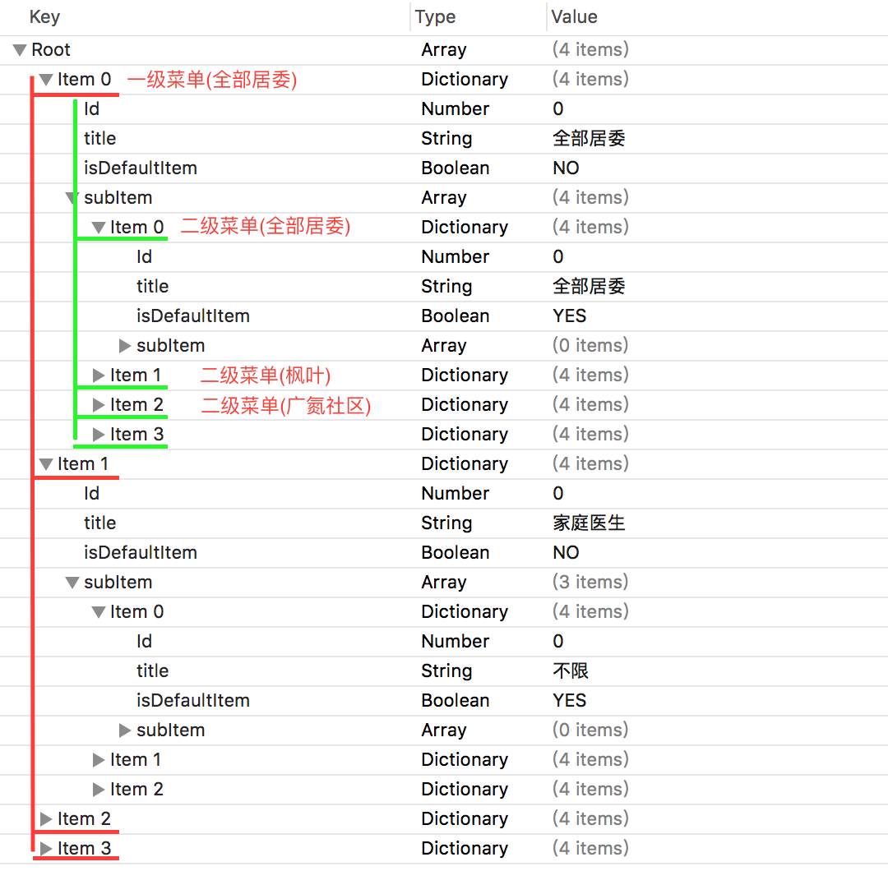
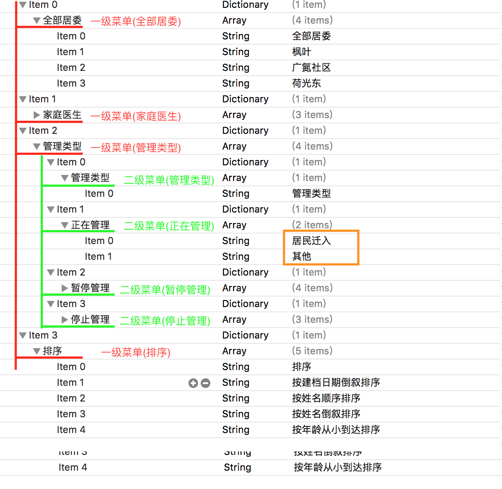
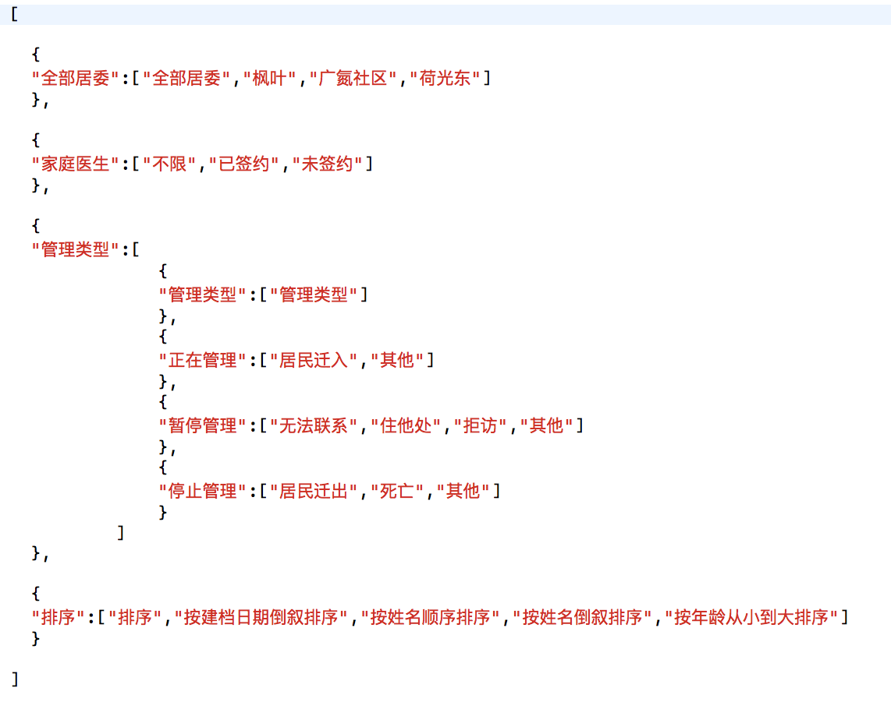
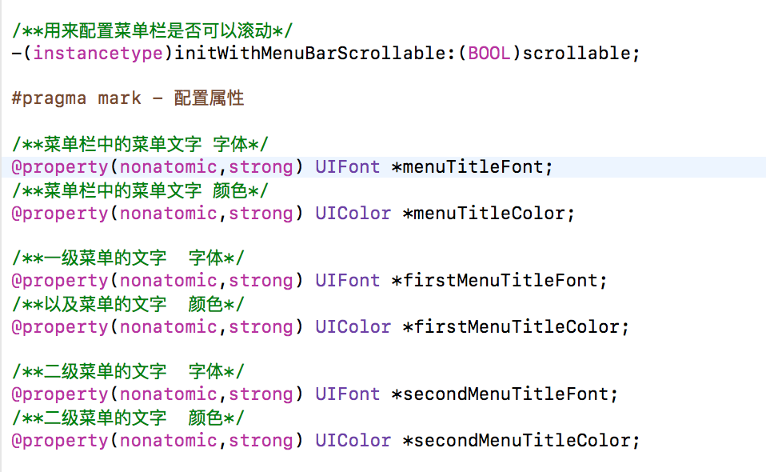

#CMDropDownMenu

* A simple and convenient drop-down menu framework
* 一个简单、方便的下拉菜单框架
* Non intrusive, word integration
* 无侵入性，一句话集成

GitHub： <a href="https://github.com/smallyou/">smallyou</a> ｜ 简书： <a href = "http://www.jianshu.com/u/ebb60643b57c">一月二十三</a> ｜ 微信公众账号：<a href="http://mp.weixin.qq.com/profile?src=3&timestamp=1490455751&ver=1&signature=jIE4PWv2qLeVLFSo1-y2R-M8jRHSEV-opZxbR5KhDUEOlgR-xxFbi*kC2QTRiqiVqJhtQB8ibIuP2dmvR2CtGw==">一路上有你</a>


##1 Started(开始使用)
###1.1 Feature(特点)
* 使用简单，直接init即可
* 数据源为数组，直接赋值即可
* 多种类型的数据源（plist/json/手动创建）

###1.2 Install(安装)
####1.2.1 cocoapods
暂无不支持， 后续扩充....
####1.2.2 手动安装
* 将项目中的 <a>CMDropDownMenu</a> 文件夹拖入到工程中
* 引入头文件 <a>#import "CMDropDownMenu.h"</a>

##2 Create DataSource(创建数据源)

###2.1 手动创建数据源
```
CMDropMenuItem *item1 = [CMDropMenuItem itemWithSuperItem:nil Id:0 title:@"全部居委" subItems:nil];
CMDropMenuItem *item11 = [CMDropMenuItem itemWithSuperItem:item1 Id:0 title:@"全部居委" subItems:nil];
item11.isDefaultItem = YES; //设置默认选项，当点击当前选项，菜单栏不会变化
CMDropMenuItem *item12 = [CMDropMenuItem itemWithSuperItem:item1 Id:0 title:@"枫叶" subItems:nil];
CMDropMenuItem *item13 = [CMDropMenuItem itemWithSuperItem:item1 Id:0 title:@"广氮社区" subItems:nil];
CMDropMenuItem *item14 = [CMDropMenuItem itemWithSuperItem:item1 Id:0 title:@"广州景联科技" subItems:nil];
CMDropMenuItem *item15 = [CMDropMenuItem itemWithSuperItem:item1 Id:0 title:@"荷光东" subItems:nil];
item1.subItems = @[item11,item12,item13,item14,item15];
    
CMDropMenuItem *item2 = [CMDropMenuItem itemWithSuperItem:nil Id:0 title:@"家庭医生" subItems:nil];
CMDropMenuItem *item21 = [CMDropMenuItem itemWithSuperItem:item2 Id:0 title:@"不限" subItems:nil];
item21.isDefaultItem = YES; //设置默认选项，当点击当前选项，菜单栏不会变化
CMDropMenuItem *item22 = [CMDropMenuItem itemWithSuperItem:item2 Id:0 title:@"已签约" subItems:nil];
CMDropMenuItem *item23 = [CMDropMenuItem itemWithSuperItem:item2 Id:0 title:@"未签约" subItems:nil];
item2.subItems = @[item21,item22,item23];

NSArray *dataTitles = @[item1, item2];
	
```

###2.2 标准格式的plist文件创建
####2.2.1 plist格式
* plist文件的root类型是NSArray,内部item是NSDictionary类型。
* 字典的key一般为<a>CMDropMenuItem</a>的属性名，如果属性名不对应，可以使用类方法<a>cm_setupReplacedKeyFromPropertyName:</a>来声明。
* 如果字典内部有NSArray属性，属性内部又包含一个模型，则可以使用类方法<a>cm_setupObjectClassInArray:</a>来声明，框架自动转换成模型数组。

【plist格式截图】



####2.2.2 加载方式
```
// 通过标准的plist文件创建数据源，返回数据源数组
- (NSArray *)setupDataSourceWithStandardFormatPlist
{
    [CMDropMenuItem cm_setupReplacedKeyFromPropertyName:@{
                                                          @"subItem":@"subItems"
                                                          }];
    
    [CMDropMenuItem cm_setupObjectClassInArray:@{
                                                 @"subItem":@"CMDropMenuItem"
                                                 }];
    
    return [CMDropMenuItem itemsWithContentsOfStandardFormatFile:[[NSBundle mainBundle] pathForResource:@"menu1.plist" ofType:nil]];
}
```

###2.3 简单格式的plist文件创建

####2.3.1 plist的格式
* plist的root类型是NSArray类型，数组中包含了字典。字典的key即为一级菜单。
* 字典的value为字符串数组时，数组中的字符串即为二级菜单
* 字典的value为字典数组时，表示有三级菜单。字典数组中的key为二级菜单，value为三级菜单

【简单plist格式截图】




####2.3.2 加载方式
```
// 通过简单的plist文件创建
- (NSArray *)setupDataSourceWithSampleFormatPlist
{
    return [CMDropMenuItem itemsWithContentsOfSampleFormatFile:[[NSBundle mainBundle] pathForResource:@"menu2.plist" ofType:nil]];
}

```


###2.4 简单格式的json文件创建

####2.4.1 json文件格式
* 格式与简单的plist类似



####2.4.2 加载方式
```
//通过简单的json文件创建数据源,返回数据源数组
- (NSArray *)setupDataSourceWithSampleFormatJson
{
    //读取数据
    NSData *data = [NSData dataWithContentsOfFile:[[NSBundle mainBundle] pathForResource:@"menu2.json" ofType:nil]];
    
    //转换成NSArray
    NSArray *array = [NSJSONSerialization JSONObjectWithData:data options:NSJSONReadingMutableLeaves error:nil];
    
    //返回
    return [CMDropMenuItem itemsWithSampleFormatKeyValueArray:array];
}
```


###2.5 其他API
* 可以设置菜单栏是否滚动，默认不可滚动
* 可以设置菜单栏的字体及颜色
* 可以设置一级子菜单的字体及颜色
* 可以设置二级子菜单的字体及颜色
* 可以设置数据源数组中的字典数组所盛放的模型





##3 Useage(使用)

###3.1 加载view

```
- (void)viewDidLoad
{
	[super viewDidLoad];
	
	//CMDropDownMenu *dropDownMenu = [[CMDropDownMenu alloc]initWithMenuBarScrollable:YES]; //设置菜单栏可以滚动  
    CMDropDownMenu *dropDownMenu = [[CMDropDownMenu alloc]init]; //默认是NO 不可滚动
    self.dropDownMenu = dropDownMenu;
    
    //可选属性配置
    dropDownMenu.menuTitleColor= [UIColor blackColor];    //在赋数据源之前设置,如果为空或不传，则默认是黑色的
    dropDownMenu.menuTitleFont = [UIFont systemFontOfSize:16.0];    //在赋数据源之前设置，如果为空或不传，则默认是16号字体
    dropDownMenu.firstMenuTitleColor = [UIColor blackColor];  //在赋数据源之前设置,如果为空或不传，则默认是黑色的
    dropDownMenu.firstMenuTitleFont = [UIFont systemFontOfSize:13.0]; //在赋数据源之前设置，如果为空或不传，则默认是13号字体
    
    
    //数据源配置
    dropDownMenu.titleDatas = [self setupDataSourceWithSampleFormatJson];   //通过简单格式的json创建
    //dropDownMenu.titleDatas = [self setupDataSourceWithSampleFormatPlist];      //通过简格式的plist创建
    //dropDownMenu.titleDatas = [self setupDataSourceWithStandardFormatPlist];  //通过标准格式的plist创建
    //dropDownMenu.titleDatas = [self setupDataSourceIgnoreSuperItem];  //通过手动创建忽略superItem
    
    dropDownMenu.delegate = self;
    [self.view addSubview:dropDownMenu];
  
    self.title = @"下拉列表菜单";

	
	
}
```

###3.2 获取选中路径

* 代理返回只是最终选中的叶子节点的CMDropMenuItem模型，可以通过模型的superItem属性反向获取整体的选中路径

```
#pragma mark - CMDropDownMenuDelegate

// 选中叶子节点后的回调
- (void)dropDownMenu:(CMDropDownMenu *)dropDownMenu didChildItemSelected:(CMDropMenuItem *)item
{
    NSString *path = @"";
    

    path = [@"选中的路径是:" stringByAppendingPathComponent:[self getChoosePath:item]];
    
    self.resultLabel.text = path;   
}


/**反向获取选择路径*/
- (NSString *)getChoosePath:(CMDropMenuItem *)item
{
    NSString *result = item.title;
    
    //获取父节点
    if (item.superItem) {
        
        CMDropMenuItem *superItem = item.superItem;
    
        //拼接
        return [[self getChoosePath:superItem] stringByAppendingPathComponent:result];
        
    }else{
        return result;
    }    
}

```

